# ComfyV 設計・仕様書

> **バージョン**: v2.8  
> **最終更新**: 2025-11-23  
> **ステータス**: 現行版

---

## 📖 このドキュメントについて

### ドキュメントの目的

このドキュメントは、ComfyVプロジェクトの設計思想、アーキテクチャ、および各機能の詳細仕様を記述した技術仕様書です。実装の詳細ではなく、**何を**、**なぜ**、**どのように**設計したかに焦点を当てています。

### 対象読者

- ComfyVの新規開発者
- 機能拡張を行う開発者
- アーキテクチャを理解したいユーザー
- 技術レビュアー

### このドキュメントの使い方

#### 新機能を追加する場合

1. **該当する大分類を特定**  
   例：新しいExecutorを追加 → `§3.1 ジョブ実行システム`

2. **新しいサブセクションを追加**  
   ```markdown
   #### 3.1.X 新しいExecutor名
   ##### 仕様
   ##### 実行フロー図
   ##### 設定例
   ##### 使用例
   ```

3. **関連するMermaid図を更新**  
   - 全体アーキテクチャ図（§2.1）
   - データフロー図（§2.3）

4. **付録を更新**  
   - 用語集に新しい用語を追加
   - 設定サンプル集に例を追加

#### プロンプト記法を拡張する場合

1. **`§3.2.4 プロンプト記法仕様`に新しいサブセクションを追加**
   ```markdown
   ##### 新しい記法名（記号）
   ###### 概要
   ###### 記法
   ###### 使用例
   ###### 処理タイミング
   ```

2. **処理順序図を更新**  
   `§3.2.4`の終わりにある処理順序Mermaid図を更新

3. **該当するステージの仕様を更新**  
   例：新しい記法がParseステージで処理される場合は`§3.2.3.①`を更新

#### データモデル・スキーマを拡張する場合

1. **`§3.4 データ永続化`のスキーマ定義を更新**
2. **ER図を更新**
3. **データフロー図（§2.3）を確認・更新**

---

## 📋 目次

1. [プロジェクト概要](#1-プロジェクト概要)
2. [システムアーキテクチャ](#2-システムアーキテクチャ)
3. [コア機能](#3-コア機能)
   - 3.1 [ジョブ実行システム](#31-ジョブ実行システム)
   - 3.2 [プロンプト解決システム](#32-プロンプト解決システムpromptresolver-v2)
   - 3.3 [ワークフロー管理](#33-ワークフロー管理)
   - 3.4 [データ永続化](#34-データ永続化)
4. [設定・構成](#4-設定構成)
5. [エラーハンドリング](#5-エラーハンドリング)
6. [拡張機能](#6-拡張機能)
7. [将来計画](#7-将来計画)
8. [付録](#8-付録)

---

## 1. プロジェクト概要

### 1.1 ComfyVとは

**ComfyV** (Comfy Verifier) は、ComfyUI APIを利用した拡張性の高い**自動画像生成・検証フレームワーク**です。

### 1.2 目的とユースケース

#### 主要目的

1. **体系的な検証の自動化**  
   LoRA、プロンプト、サンプラー設定など、複数のパラメータが画像生成に与える影響を、全組み合わせ（グリッドサーチ）またはシーケンシャルに自動検証

2. **プロンプト生成の効率化**  
   プリセット、ワイルドカード、プレースホルダーなどの機能を駆使し、少ない記述量で多様なプロンプトを体系的に生成

3. **再現性とデータ管理**  
   全ての生成結果（画像、使用したワークフロー、パラメータ）をデータベースに記録し、完全な再現性を確保

#### ユースケース

- **LoRA比較検証**: 複数のLoRAの重みやCFGスケールの最適値を探索
- **プロンプトテスト**: 異なるプロンプト表現の効果を比較
- **バッチ生成**: 特定のテーマに沿った画像を大量に生成
- **パラメータ最適化**: サンプラー、ステップ数などの最適な組み合わせを発見

### 1.3 バージョン履歴

| バージョン | リリース日 | 主要機能 |
|-----------|-----------|---------|
| v1.0 | - | 初期実装、PromptResolver V1 |
| v2.0 | 2025-07-14 | PromptResolver V2 (6ステージパイプライン) |
| v2.1 | - | Pydantic型安全性、Reporter分離 |
| v2.2 | - | 6ステージパイプライン完全統合 |
| v2.3〜2.4 | - | Placeholder/Wildcard/Filter/Format完全実装 |
| v2.5 | 2025-07-19 | V2完全実装、245テスト100%PASS |
| v2.6 | - | プロンプトリスト記法サポート |
| v2.7 | - | Iterator機能追加 |
| v2.8 | - | Constant機能追加 |
| v2.9 | - | scene_delta（旧prompts_delta、差分プロンプト）、_params（ワークフローパラメータ set→継承）、constantsのList対応、--dump-prompts、ネストjobsのbase_workflow解決改善、ComfyUI 400エラー本文ログ |

### 1.4 技術スタック

#### コア技術

- **Python**: 3.10+
- **Lark**: 1.1.7（パーサー生成）
- **Pydantic**: 1.10.13（型検証）
- **SQLite**: データベース
- **PyYAML**: 設定ファイル
- **ordered-set**: 4.1.0（順序保持集合演算）

#### テスト技術

- **pytest**: 7.4.3
- **hypothesis**: 6.99.2（プロパティベーステスト）

---

## 2. システムアーキテクチャ

### 2.1 全体構成

#### アーキテクチャ図

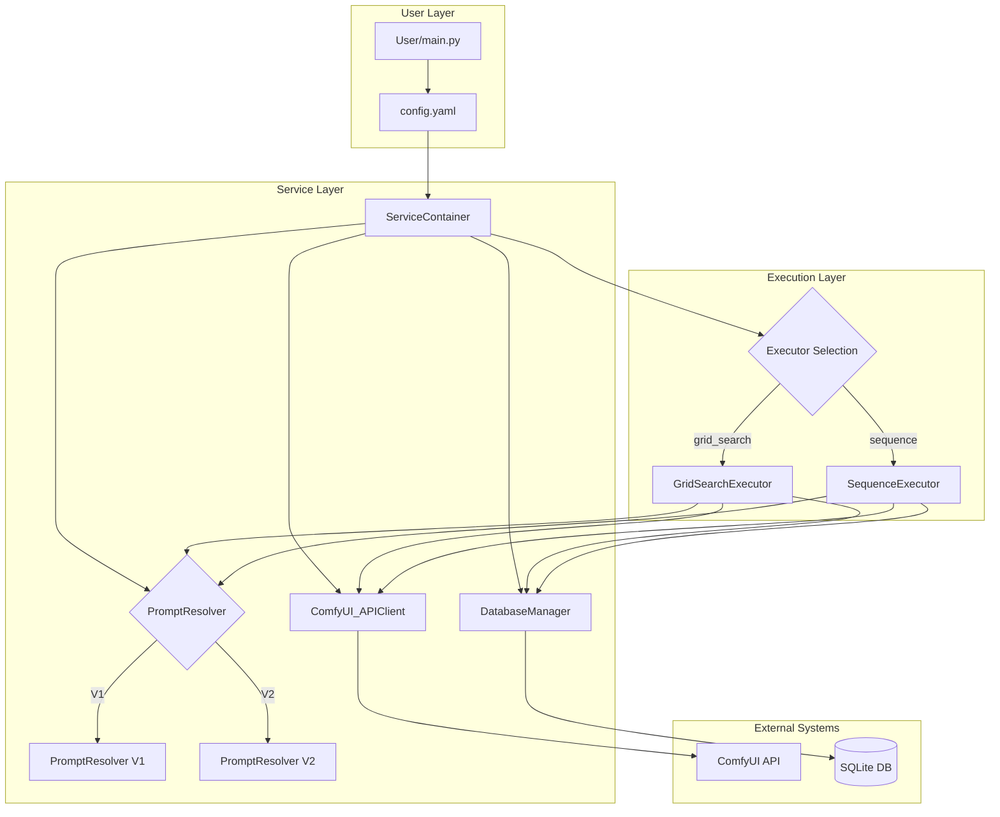

### 2.2 コンポーネント一覧

#### 主要コンポーネント

| コンポーネント | 責務 | 実装ファイル |
|--------------|------|-------------|
| **ServiceContainer** | 依存性管理、シングルトン提供 | `core/service_container.py` |
| **BaseExecutor** | 実行基盤、共通処理 | `core/executors/base_executor.py` |
| **GridSearchExecutor** | 全組み合わせ検証 | `core/executors/grid_search_executor.py` |
| **SequenceExecutor** | シーケンシャル実行 | `core/executors/sequence_executor.py` |
| **PromptResolverV2** | 6ステージパイプライン | `core/prompt_resolver_v2.py` |
| **DatabaseManager** | SQLiteデータ管理 | `core/database.py` |
| **ComfyUI_APIClient** | ComfyUI通信 | `core/api_client.py` |
| **WorkflowLoader** | ワークフロー読み込み | `core/workflow_loader.py` |
| **Reporter** | レポート生成 | `core/reporting/reporter.py` |

### 2.3 データフロー

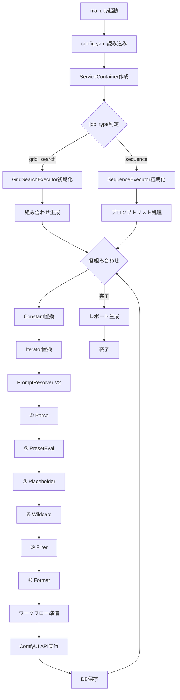

### 2.4 ディレクトリ構造

```
comfyv/
├── main.py                    # エントリーポイント
├── core/
│   ├── config.py              # 設定管理
│   ├── database.py            # DB管理
│   ├── api_client.py          # API通信
│   ├── prompt_resolver.py     # V1実装
│   ├── prompt_resolver_v2.py  # V2実装
│   ├── service_container.py   # DI Container
│   ├── workflow_loader.py     # ワークフロー読み込み
│   ├── interfaces.py          # インターフェース定義
│   ├── mock_services.py       # モック実装
│   │
│   ├── resolver/              # V2パイプライン実装
│   │   ├── ast.py                # AST定義
│   │   ├── context.py            # ResolverContext
│   │   ├── parser.py             # ① Parse
│   │   ├── preset.py             # ② PresetEval
│   │   ├── placeholder.py        # ③ Placeholder
│   │   ├── wildcard.py          # ④ Wildcard
│   │   ├── filter.py            # ⑤ Filter
│   │   ├── formatter.py         # ⑥ Format
│   │   ├── exceptions.py         # 例外定義
│   │   └── template.lark         # Lark文法
│   │
│   ├── schemas/               # Pydantic型定義
│   │   └── config_models.py
│   │
│   ├── reporting/             # レポート生成
│   │   ├── base.py
│   │   ├── html.py
│   │   └── reporter.py
│   │
│   └── executors/             # Executor実装
│       ├── base_executor.py
│       ├── grid_search_executor.py
│       └── sequence_executor.py
│
├── prompts/                   # プロンプトファイル
│   ├── presets/              # プリセット定義
│   └── wildcards/            # ワイルドカード定義
│
├── configs/                   # 設定ファイル
├── results/                   # 出力結果
│   ├── images/
│   └── index.sqlite
│
├── templates/                 # テンプレート
│   └── report.html.j2
│
└── tests/                     # テストスイート
    ├── resolver/             # V2個別テスト
    └── integration/          # 統合テスト
```

---

## 3. コア機能

### 3.1 ジョブ実行システム

#### 3.1.1 概要と設計思想

ComfyVのジョブ実行システムは**ストラテジーパターン**を採用し、異なる実行戦略を切り替え可能な設計になっています。

**設計原則**:
- ✅ 単一責任の原則：各Executorは1つの実行戦略のみを実装
- ✅ 開放/閉鎖の原則：新しいExecutorの追加が容易
- ✅ 依存性の逆転：BaseExecutorに依存、具象クラスには依存しない

#### 3.1.2 GridSearchExecutor

##### 仕様

**目的**: 複数のパラメータ軸の全組み合わせ（デカルト積）を網羅的に検証

**適用シーン**:
- LoRAの比較検証
- パラメータ間の相互作用調査
- 最適なパラメータ組み合わせの探索

**動作原理**:
1. `variables`に定義された全パラメータ軸の直積を生成
2. `placeholders`による追加の次元展開
3. 各組み合わせに対してプロンプト解決→ワークフロー実行

##### 実行フロー図

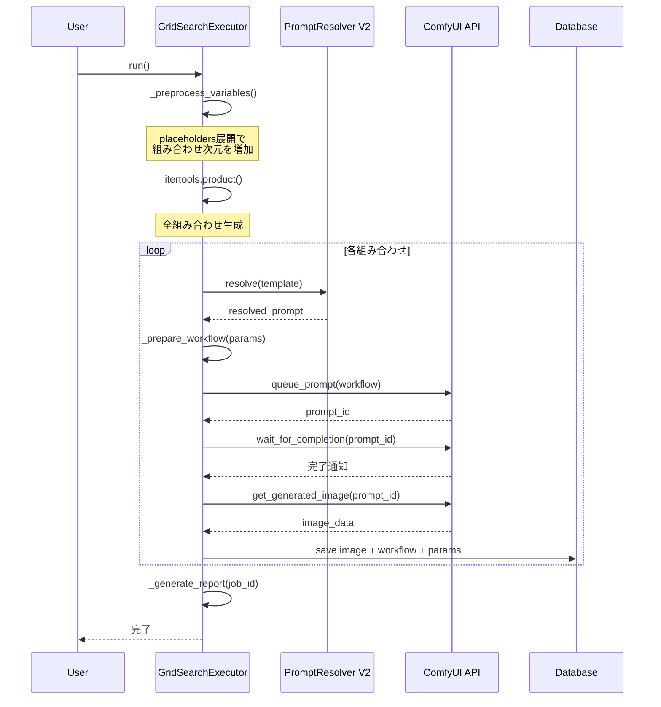

##### 設定例

```yaml
job_type: "grid_search"
job_name: "lora_vs_cfg_scale_grid_test"
base_workflow: "./workflows/base.json"

placeholders:
  composition: ["close-up", "full body"]

fixed_parameters:
  - {node_id: 171, input_name: "seed", value: 12345}

variables:
  # 軸1: プロンプト
  - node_id: 149
    input_name: "text"
    values:
      - "<preset:quality>, 1girl, __hair_color__, {composition}"
  
  # 軸2: LoRAの重み
  - node_id: 116
    input_name: "model_weight_1"
    values: [0.6, 0.8, 1.0]

  # 軸3: CFGスケール
  - node_id: 171
    input_name: "cfg"
    values: [5.0, 7.0]
```

**実行結果**: 
- composition: 2種類
- model_weight_1: 3種類
- cfg: 2種類
- 合計: 2 × 3 × 2 = **12枚の画像**

##### 使用例

```bash
# 設定ファイルを指定して実行
uv run python main.py --config configs/grid_search_lora_test.yaml
```

#### 3.1.3 SequenceExecutor

##### 仕様

**目的**: 定義されたプロンプトや設定のリストを上から順に1回ずつ実行

**適用シーン**:
- アイデア出し・コンセプトアート生成
- 特定のテーマに沿った画像を複数枚生成
- ストーリーボード作成

**動作原理**:
1. Constant置換（`%...%`）
2. Iterator置換（`$[...]`）
3. プロンプト解決（PromptResolver V2）
4. ランダムパラメータ生成
5. パラメータ組み合わせ適用
6. ワークフロー実行

##### 実行フロー図

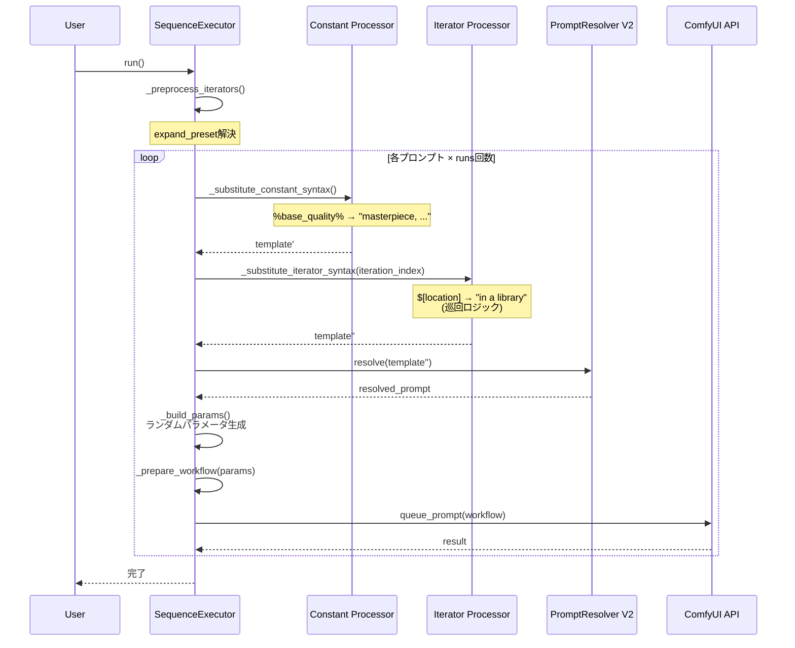

##### 設定例

```yaml
job_type: "sequence"
job_name: "random_character_batch"
base_workflow: "./workflows/base.json"

# Constant定義（固定文字列）
constants:
  base_quality: "masterpiece, best quality, amazing quality"
  base_character: "1girl, shiina yuika"

# Iterator定義
iterators:
  # 手動リスト
  location:
    - "in a library"
    - "in a cafe"
    - "at a futuristic spaceport"
  
  # プリセット展開
  expression:
    expand_preset: "expression"

# プロンプト適用先
prompt_target:
  node_id: 149
  input_name: "text"

# ランダムパラメータ
random_parameters:
  - {node_id: 171, input_name: "seed", type: "int", range: [0, 999999999]}
  - {node_id: 116, input_name: "model_weight_1", type: "choice", values: [0.6, 0.7, 0.8]}

# プロンプトリスト
prompts:
  # 新形式：リスト記法
  - - "%base_quality%"
    - "%base_character%"
    - "$[expression]"
    - "$[location]"
  
  # 従来形式
  - template: "%base_quality%, %base_character%, happy, smiling"
    runs: 3
```

##### 使用例

```bash
# 設定ファイルを指定して実行
uv run python main.py --config configs/sequence_character_test.yaml
```

#### 3.1.4 Executor拡張ガイド

新しいExecutorを追加する手順：

##### ステップ1: BaseExecutorを継承

```python
# core/executors/my_custom_executor.py
from .base_executor import BaseExecutor

class MyCustomExecutor(BaseExecutor):
    def __init__(self, config, service_container):
        super().__init__(config, service_container)
        # カスタム初期化
    
    def run(self):
        # 実行ロジックを実装
        job_id = self.db.create_job(self.config.job_name, self.config.job_config_data)
        
        # ... 実行処理 ...
        
        self.db.complete_job(job_id)
```

##### ステップ2: main.pyに登録

```python
# main.py
from core.executors.my_custom_executor import MyCustomExecutor

def create_executor(config, container):
    if config.job_type == "my_custom":
        return MyCustomExecutor(config, container)
    # ... 既存のExecutor選択 ...
```

##### ステップ3: 設定スキーマ更新

```python
# core/schemas/config_models.py
JOB_TYPE = Literal["grid_search", "sequence", "my_custom"]
```

---

### 3.2 プロンプト解決システム（PromptResolver V2）

#### 3.2.1 概要と設計思想

PromptResolver V2は、テンプレート文字列を段階的に処理して最終的なプロンプト文字列を生成する**6ステージパイプライン**です。

**設計原則**:
- **純関数的設計**: 各ステージは副作用なし
- **AST変換**: 段階的なツリー変換処理
- **型安全性**: Pydantic BaseModelによる厳密な型定義
- **拡張性**: 新しいステージの追加が容易

#### 3.2.2 6ステージパイプライン

##### パイプライン全体図

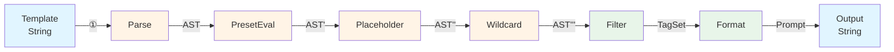

##### 処理順序詳細図

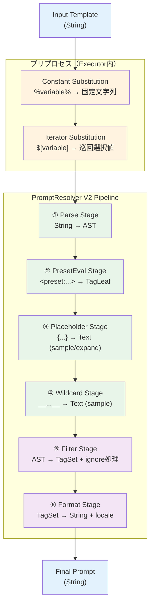

#### 3.2.3 ステージ詳細

##### ① Parse ステージ

###### 仕様

**責務**: テンプレート文字列を抽象構文木（AST）に変換

**入力**: `str`（テンプレート文字列）  
**出力**: `TemplateAST`（ASTノードのリスト）

**技術**:
- **パーサー**: Lark LALR(1)パーサー
- **文法**: EBNF形式（`template.lark`）
- **出力**: TypedDict階層構造

###### AST定義

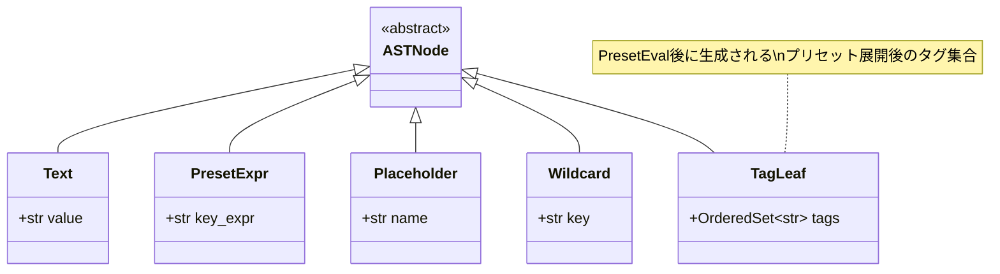

**TemplateAST**: `List[ASTNode]`

###### 文法定義（EBNF）

```lark
template: (text | preset | placeholder | wildcard)+

preset: "<preset:" key_expr ">"
placeholder: "{" NAME "}"
wildcard: WILDCARD

key_expr: GROUP (("+" | "-") GROUP)*
GROUP: NAME ("#" NAME)?

TEXT.1: /([^<{}_]|_(?!_))+/
WILDCARD.2: "__" /[A-Za-z0-9_\-\/]+/ "__"
NAME: /[A-Za-z0-9_\-\/]+/

%ignore /\s+/
```

**優先度設定**:
- `WILDCARD.2` > `TEXT.1`（数字が大きい方が優先）
- アンダースコア含むテキストとワイルドカードの競合を解決

###### 実装詳細

**パフォーマンス最適化**:
- Larkインスタンスのスレッドセーフキャッシュ
- 文法ハッシュベースのキャッシング
- 結果: **13.5倍高速化** (0.135秒 → 0.010秒)

**エラーハンドリング**:
- 位置情報付きエラー（line, column, position）
- 再帰深度制御（MAX_DEPTH=20）
- ParseError例外

---

##### ② PresetEval ステージ

###### 仕様

**責務**: PresetExprノードをTagLeafノードに変換（プリセット展開）

**入力**: `TemplateAST`（PresetExpr含む）  
**出力**: `TemplateAST`（PresetExpr → TagLeaf変換済み）

**技術**:
- 手動トークン化パーサー
- OrderedSet集合演算
- 左から右への演算評価

###### グループ演算ルール

**サポート演算**:
- `+`（Union）: タグセットの和集合
- `-`（Difference）: タグセットの差集合

**演算則**:
1. **左結合**: 左から右へ順次評価
2. **同一プリセット内のみ**: クロスプリセット演算は未定義
3. **グループ省略継承**: `#`なしトークンは直前プリセットのグループ

**例**:
```
quality#base+hdr-unwanted
→ quality#base ∪ quality#hdr ∖ quality#unwanted
```

###### key_expr解析アルゴリズム

```python
def tokenize_key_expr(key_expr: str) -> List[Tuple[preset, group, op]]:
    """
    "quality#base+hdr-unwanted" 
    → [
        ("quality", "base", "+"),
        ("quality", "hdr", "+"),
        ("quality", "unwanted", "-")
    ]
    """
    # 1. 演算子で分割
    tokens = re.split(r'(\+|\-)', key_expr)
    
    # 2. 最初のトークン処理
    first = tokens[0]
    preset, group = parse_group_token(first)
    operations = [(preset, group, "+")]
    
    # 3. 残りのトークンをペアで処理
    for i in range(1, len(tokens), 2):
        operator = tokens[i]
        group_token = tokens[i+1]
        
        # クロスプリセット検出
        if '#' in group_token:
            raise ValueError("Cross-preset operations are undefined")
        
        operations.append((preset, group_token, operator))
    
    return operations
```

###### 実装詳細

**ignore_groups統合**:
- `resolve_group()`段階で早期除外
- Placeholder展開前の冗長組み合わせ抑制

**再パース機能**:
- プリセット値内の`<preset:...>`を再帰展開
- MAX_DEPTH=20の深度制限
- 多段ネスト対応

**エラーハンドリング**:
- PresetNotFoundError
- strict_level対応（error/warn/soft）

---

##### ③ Placeholder ステージ

###### 仕様

**責務**: Placeholderノードをテキストに置換

**入力**: `TemplateAST`（Placeholder含む）  
**出力**: 
- `sampleモード`: 単一AST
- `expandモード`: ASTのリスト（全組み合わせ）

**技術**:
- itertools.product（直積展開）
- LRUキャッシュ（50エントリ）
- 再パース機能

###### sampleモード vs expandモード

**sampleモード**:
- 各Placeholderからランダムに1つ選択
- 単一のASTを返す
- 使用例: Sequence実行時

```python
template = "1girl, {emotion} face, {pose}"
placeholders = {
    "emotion": ["happy", "sad", "excited"],
    "pose": ["standing", "sitting"]
}
# 結果: "1girl, happy face, standing" (ランダム)
```

**expandモード**:
- 全Placeholderの直積展開
- ASTのリストを返す
- 使用例: GridSearch前処理

```python
template = "{emotion} girl, {pose}"
# 結果: [
#   "happy girl, standing",
#   "happy girl, sitting",
#   "sad girl, standing",
#   "sad girl, sitting",
#   "excited girl, standing",
#   "excited girl, sitting"
# ]
```

###### 再パース機能

Placeholder値に含まれるテンプレート構文を再パース展開:

```python
placeholders = {
    "style": [
        "<preset:quality#base>",  # Preset再パース
        "{nested}",               # Placeholder再パース
        "__wildcard__"            # Wildcard再パース
    ]
}
```

**多段ネスト対応**:
- while再帰による完全展開
- 最大イテレーション: 15回
- RecursionLimitError防止

###### 実装詳細

**メモリ制限**:
- MAX_EXPANSION=128（129件目でエラー）
- isliceによる真の制限実装

**パフォーマンス最適化**:
- LRUキャッシュ(50エントリ)
- deepcopy最小化

**エラーハンドリング**:
- PlaceholderError（未定義・空候補）
- RecursionLimitError（深度超過）

---

##### ④ Wildcard ステージ

###### 仕様

**責務**: WildcardノードをランダムなTextに置換

**入力**: `TemplateAST`（Wildcard含む）  
**出力**: `TemplateAST`（Wildcard → Text変換済み）

**技術**:
- sampleモード専用（ランダム選択）
- 再パース機能
- フォールバック保護

###### sampleモード

```python
template = "1girl, __hair_color__"
wildcards = {
    "hair_color": ["blonde hair", "black hair", "brown hair"]
}
# 結果: "1girl, blonde hair" (ランダム選択)
```

###### 再パース機能

Wildcard値に含まれるテンプレート構文を再パース:

```txt
# prompts/wildcards/style.txt
<preset:quality#base>
<preset:anime#kawaii>
photorealistic
```

```python
template = "__style__, 1girl"
# 結果: "masterpiece, best quality, 1girl" (Preset展開後)
```

###### 実装詳細

**フォールバック保護**:
```python
def _is_fallback_wildcard(choice: str) -> bool:
    """
    __undefined__形式を検出して無限再帰を防止
    """
    return re.match(r'^__[A-Za-z0-9_-]+__$', choice) is not None
```

**エラーハンドリング**:
- WildcardError（未定義・空候補）
- フォールバック文字列: `__key__`形式で安全な置換

---

##### ⑤ Filter ステージ

###### 仕様

**責務**: ASTをTagSetに変換し、ignore_tags/ignore_groupsを適用

**入力**: `TemplateAST`（最終AST）  
**出力**: `OrderedSet[str]`（TagSet）

**技術**:
- AST走査・統合
- OrderedSet高速集合演算
- ignore処理

###### ignore_tags処理

```python
context.ignore_tags = {"HDR", "lowres"}

# 入力TagSet
tagset = ["masterpiece", "HDR", "1girl", "lowres"]

# 出力TagSet
result = ["masterpiece", "1girl"]  # HDR, lowresが除外
```

###### ignore_groups処理

PresetEvalステージで早期除外済み（統合処理）

###### 実装詳細

**Text節点処理**:
- 分割せず単一要素として保持
- 仕様変更（当初は分割想定）

**TagLeaf節点処理**:
- OrderedSet統合
- 順序保持

---

##### ⑥ Format ステージ

###### 仕様

**責務**: TagSetを最終プロンプト文字列に変換

**入力**: `OrderedSet[str]`（TagSet）  
**出力**: `str`（最終プロンプト）

**技術**:
- locale対応
- 順序保持結合
- 将来拡張準備

###### locale対応

| locale | 区切り文字 | 出力例 |
|--------|----------|--------|
| `,` | `, ` (カンマ+スペース) | `tag1, tag2, tag3` |
| `、` | `、` (全角読点) | `tag1、tag2、tag3` |
| `;` | `;` (セミコロン) | `tag1;tag2;tag3` |

**重要仕様**:
- **単一要素時**: locale変換なし、元文字列保持
- **複数要素時**: 指定locale区切り文字で結合

###### 将来拡張（sort_alpha, shuffle）

```python
def _apply_formatting_options(self, tags: List[str]) -> List[str]:
    # 将来拡張: sort_alpha機能
    # if self.context.sort_alpha:
    #     tags = sorted(tags, key=str.lower)
    
    # 将来拡張: shuffle機能
    # if self.context.shuffle:
    #     self.context.rng.shuffle(tags)
    
    return tags
```

###### 実装詳細

**パターン判定結合**:
```python
# 先頭/末尾にスペース・カンマがある場合は直結合
if tag.startswith(' ') or prev_tag.endswith(' '):
    result_parts.append(tag)
else:
    result_parts.append(delimiter + tag)
```

**エラーハンドリング**:
- PromptFormatterError
- locale未対応時のフォールバック

---

#### 3.2.4 プロンプト記法仕様

##### Constant記法（%...%）

###### 概要

変化しない固定のプロンプト部分を定数として定義する機能。`SequenceExecutor`専用。

###### 記法

```yaml
constants:
  base_quality: "masterpiece, best quality, amazing quality"
  base_character: "1girl, shiina yuika"

prompts:
  - template: "%base_quality%, %base_character%, happy"
```

###### 使用例

```yaml
constants:
  base_setup: "1girl, <preset:quality>"

prompts:
  - template: "%base_setup%, $[emotion], sitting"
```

###### 処理タイミング

**最優先**: Iterator処理より前、PromptResolver V2より前

```
Template → Constant置換 → Iterator置換 → PromptResolver V2
```

---

##### Iterator記法（$[...]）

###### 概要

プロンプト内で特定の要素を順次（シーケンシャル）に変化させる機能。`SequenceExecutor`専用。

###### 記法

**手動リスト定義**:
```yaml
iterators:
  location:
    - "in a library"
    - "in a cafe"
    - "at a futuristic spaceport"

prompts:
  - template: "1girl, $[location]"
    runs: 6
```

**プリセット展開**:
```yaml
iterators:
  expression:
    expand_preset: "expression"  # 全グループを参照形式に展開

prompts:
  - template: "1girl, $[expression]"
```

###### expand_preset機能

プリセットの全グループを自動展開:

```yaml
# prompts/presets/expression.yaml
contents:
  smile: "happy, smiling"
  sad: "sad, crying"
  angry: "angry, frowning"
```

```yaml
iterators:
  expression:
    expand_preset: "expression"
```

**内部処理**:
```python
# expand後のIteratorリスト
[
    "<preset:expression#smile>",
    "<preset:expression#sad>",
    "<preset:expression#angry>"
]
```

###### 使用例

**巡回ロジック**:
```yaml
iterators:
  mood: ["happy", "sad"]      # 2要素
  place: ["park", "beach", "mountain"]  # 3要素

prompts:
  - template: "1girl, $[mood], $[place]"
    runs: 7
```

**実行結果**:
- 1回目: mood[0]="happy", place[0]="park"
- 2回目: mood[1]="sad", place[1]="beach"
- 3回目: mood[0]="happy", place[2]="mountain" (mood巡回)
- 4回目: mood[1]="sad", place[0]="park" (place巡回)
- ...

###### 処理タイミング

Constant置換の後、PromptResolver V2の前

```
Template → Constant → Iterator → PromptResolver V2
```

---

##### Preset記法（<preset:...>）

###### 概要

頻繁に使うプロンプトの塊を再利用可能な名前付き部品として定義。

###### 記法

**基本**:
```
<preset:quality>                  # 全グループの和集合
<preset:quality#default>          # defaultグループのみ
<preset:quality#default+hdr>      # 複数グループ結合
<preset:quality#default-unwanted> # グループ差集合
```

**ファイル階層**:
```
<preset:character/akira#base>
<preset:character/akira/school_uniform#default>
```

###### グループ演算

**サポート演算**:
- `+`: Union（和集合）
- `-`: Difference（差集合）

**演算則**:
- 左結合（左から右へ評価）
- 同一プリセット内のみ有効
- クロスプリセット演算はエラー

**例**:
```
<preset:quality#base+hdr-unwanted>
= (quality#base ∪ quality#hdr) ∖ quality#unwanted
```

###### V1/V2形式

**V2形式（推奨）**:
```yaml
# prompts/presets/quality.yaml
version: 2
contents:
  default: "masterpiece, best quality"  # 横書き可
  hdr: ["HDR", "vibrant colors"]        # リスト形式
```

**V1形式（互換）**:
```yaml
# prompts/presets/character.yaml
- hero girl
- warrior
- solo
```

→ 自動的に `contents: {"__all__": [...]}` に変換

###### 使用例

```yaml
prompts:
  - template: "<preset:quality#base+hdr>, 1girl, <preset:character/akira#school_uniform>"
```

###### ファイル階層サポート

```
prompts/presets/
├── quality.yaml
├── character/
│   └── akira/
│       ├── base.yaml
│       └── school_uniform.yaml
└── scene/
    ├── indoor.yaml
    └── outdoor.yaml
```

**参照例**:
```
<preset:quality>
<preset:character/akira#base>
<preset:scene/indoor#bedroom>
```

###### 処理タイミング

PromptResolver V2の②PresetEvalステージ

---

##### Placeholder記法（{...}）

###### 概要

設定値からランダム選択または全展開する機能。

###### 記法

```yaml
placeholders:
  emotion: ["happy", "sad", "excited"]
  pose: ["standing", "sitting", "lying"]

# 使用
template: "1girl, {emotion} face, {pose}"
```

###### 動作モード

**sampleモード**（デフォルト）:
```
結果: "1girl, happy face, standing"  # ランダム選択
```

**expandモード**（GridSearch時）:
```
結果: [
  "1girl, happy face, standing",
  "1girl, happy face, sitting",
  "1girl, happy face, lying",
  "1girl, sad face, standing",
  # ... 全9パターン
]
```

###### 使用例

**GridSearchでの展開**:
```yaml
placeholders:
  composition: ["close-up", "full body"]
  style: ["<preset:anime>", "<preset:photorealistic>"]

variables:
  - node_id: 149
    input_name: "text"
    values:
      - "1girl, {composition}, {style}"
```

→ 4パターンに展開（2 × 2）

###### 処理タイミング

PromptResolver V2の③Placeholderステージ

---

##### Wildcard記法（__...__）

###### 概要

ワイルドカードファイルからランダムに1つ選択する機能。

###### 記法

```txt
# prompts/wildcards/hair_color.txt
blonde hair
black hair
brown hair
red hair
```

```yaml
template: "1girl, __hair_color__"
```

###### 使用例

**ネスト再パース**:
```txt
# prompts/wildcards/style.txt
<preset:quality#base>
<preset:anime#kawaii>
photorealistic
```

```yaml
template: "__style__, 1girl"
# 結果: "masterpiece, best quality, 1girl" (Preset展開後)
```

###### 処理タイミング

PromptResolver V2の④Wildcardステージ

---

##### 記法の処理順序

```mermaid
flowchart LR
    A[Template] --> B["%Constant%"]
    B --> C["$Iterator"]
    C --> D[Parse]
    D --> E["&lt;Preset&gt;"]
    E --> F["{Placeholder}"]
    F --> G["__Wildcard__"]
    G --> H[Filter]
    H --> I[Format]
    
    style A fill:#e1f5ff
    style B fill:#fff3e0
    style C fill:#fff3e0
    style D fill:#e8f5e9
    style E fill:#e8f5e9
    style F fill:#e8f5e9
    style G fill:#e8f5e9
    style H fill:#f3e5f5
    style I fill:#f3e5f5
```

**処理順序まとめ**:
1. **Constant置換**（SequenceExecutor）
2. **Iterator置換**（SequenceExecutor）
3. **Parse**（PromptResolver V2）
4. **Preset展開**（PromptResolver V2）
5. **Placeholder展開**（PromptResolver V2）
6. **Wildcard展開**（PromptResolver V2）
7. **Filter**（PromptResolver V2）
8. **Format**（PromptResolver V2）

---

#### 3.2.5 V1/V2互換性

##### ServiceContainerでの切り替え

```python
# 環境変数で制御
export PROMPT_RESOLVER_V2=true

# またはコード内で明示的に指定
resolver = container.get_prompt_resolver(use_v2=True)
```

##### V1形式プリセットの自動変換

```python
# V1形式（list）
data = ["tag1", "tag2", "tag3"]

# V2形式に自動変換
preset_file = PresetFile(
    version=1,
    contents={"__all__": data}
)
```

##### API互換性

```python
# V1互換API
resolved = resolver.resolve_full(template, placeholders)

# V2ネイティブAPI
resolved = resolver.resolve(template)  # sampleモード
expanded = resolver.expand_placeholders(template, placeholders)  # expandモード
```

---

### 3.3 ワークフロー管理

#### 3.3.1 WorkflowLoader概要

WorkflowLoaderは、ComfyUIワークフロー（APIフォーマット）を読み込み、ノード参照を解決する機能を提供します。

**主要機能**:
- ワークフローファイルの読み込み
- ノード名→ノードIDの解決
- ノード参照の検証
- ノード一覧の取得

#### 3.3.2 ノード参照方法

##### ノードID指定（従来方式）

```yaml
variables:
  - node_id: 8
    input_name: "samples"
    values: ["value1", "value2"]
```

##### ノード名指定（新方式）

```yaml
variables:
  - node_id: "VAEデコード"
    input_name: "samples"
    values: ["value1", "value2"]
```

**ノード名の取得順序**:
1. `_meta.title` フィールド（優先）
2. `class_type` フィールド（フォールバック）

##### 混在指定

同一設定ファイル内でノードIDとノード名を混在可能:

```yaml
variables:
  - node_id: 8              # ID指定
    input_name: "samples"
    values: ["value1"]
  - node_id: "VAEデコード"   # 名前指定（同じノード）
    input_name: "vae"
    values: ["value2"]
```

#### 3.3.3 使用例

**デバッグ用スクリプト**:
```bash
uv run python demo_workflow_loader.py
```

**出力例**:
```
📋 Available Nodes:
------------------------------
    8 | VAEデコード                   | VAEDecode
   30 | CLIPテキストエンコードSDXL         | CLIPTextEncodeSDXL
   54 | 💊 CR LoRA Stack           | CR LoRA Stack
```

**注意事項**:
- 重複するノード名がある場合は警告が表示される
- 重複時はノードID指定を推奨

---

### 3.4 データ永続化

#### 3.4.1 データベース設計

ComfyVの全メタデータは単一のSQLiteデータベース（`results/index.sqlite`）に集約されます。

##### スキーマ定義

###### jobsテーブル

| カラム名 | データ型 | 説明 | 制約 |
|---------|---------|------|------|
| `id` | INTEGER | ジョブID | PK, AUTOINCREMENT |
| `name` | TEXT | ジョブ名 | NOT NULL |
| `config` | TEXT | ジョブ設定（JSON） | NOT NULL |
| `status` | TEXT | ステータス（running/completed/failed） | NOT NULL |
| `created_at` | TIMESTAMP | 作成日時 | DEFAULT CURRENT_TIMESTAMP |

###### imagesテーブル

| カラム名 | データ型 | 説明 | 制約 |
|---------|---------|------|------|
| `id` | INTEGER | 画像ID | PK, AUTOINCREMENT |
| `job_id` | INTEGER | ジョブID（外部キー） | FK → jobs.id |
| `filepath` | TEXT | ファイルパス | |
| `workflow` | TEXT | 実行ワークフロー（JSON） | NOT NULL |
| `parameters` | TEXT | 適用パラメータ（JSON） | NULL許可（後方互換性、Phase 2で追加） |
| `status` | TEXT | ステータス（pending/success/failed） | NOT NULL |
| `created_at` | TIMESTAMP | 作成日時 | DEFAULT CURRENT_TIMESTAMP |

##### ER図

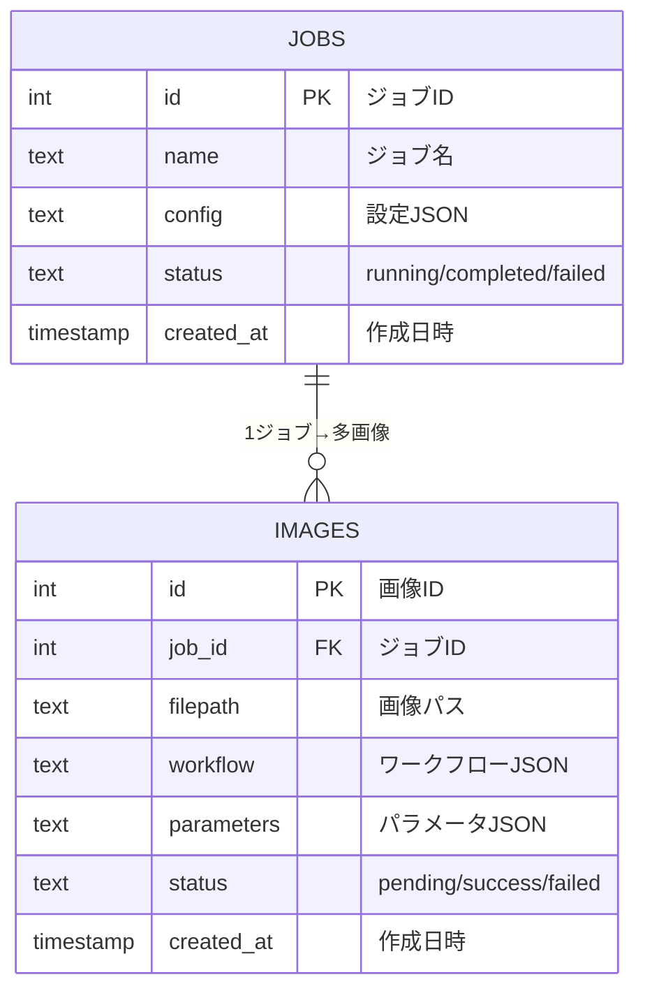

#### 3.4.2 DatabaseManager

主要メソッド:

```python
class DatabaseManager:
    def create_job(self, name: str, config: dict) -> int
    def update_job_status(self, job_id: int, status: str)
    def complete_job(self, job_id: int)
    
    def create_image_record(self, job_id: int, workflow: dict) -> int
    def update_image_record(self, image_id: int, filepath: str, status: str)
    def get_images_by_job_id(self, job_id: int) -> List[dict]
```

#### 3.4.3 データフロー

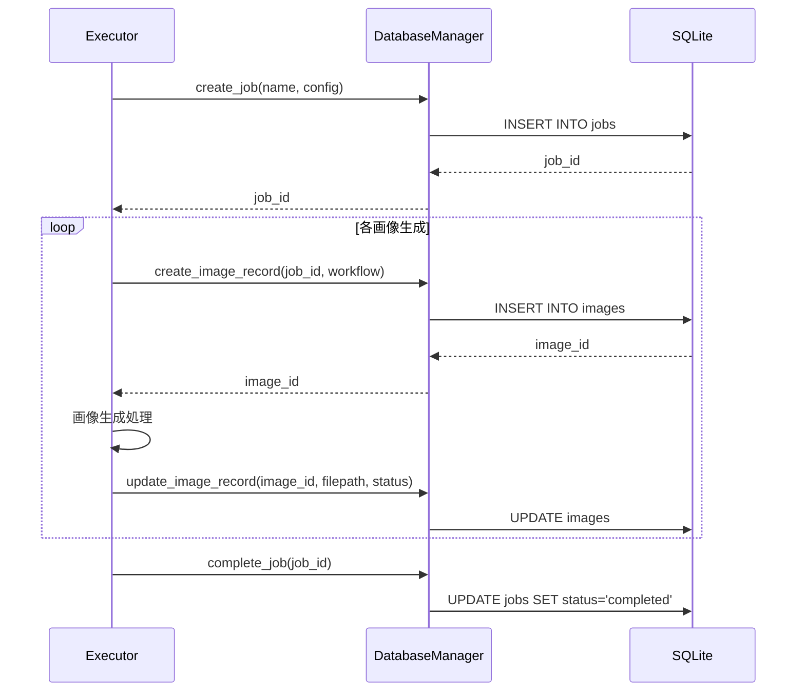

---

## 4. 設定・構成

### 4.1 config.yaml構造

#### 4.1.1 全体スキーマ

```yaml
# ジョブタイプ（必須）
job_type: "grid_search" | "sequence"

# ジョブ名（必須）
job_name: "my_job_name"

# ベースワークフロー（GridSearchでは必須）
base_workflow: "./workflows/base.json"

# パス解決（現行実装の例）
# - job config が configs/jobs/** 配下にある場合は configs/ を基準に相対パス解決
#   - base_workflow: "workflows/base.json" → configs/workflows/base.json

# プロンプトディレクトリ
prompts_dir: "configs/prompts"  # デフォルト

# サーバーアドレス（http://host:port または host:port 形式）
server_address: "127.0.0.1:8188"  # host:port形式（推奨）
# server_address: "http://localhost:8188"  # http://形式も可
# server_address: "https://example.com:8188"  # https://形式も可

# PromptResolver設定
ignore_tags: []
ignore_groups: []
locale: ","  # or "、" or ";"
strict_level: "warn"  # or "error" or "soft"
seed: null

# ジョブタイプ固有設定
# ... (以下参照)
```

#### 4.1.2 共通設定

```yaml
# 固定パラメータ（全生成で共通）
fixed_parameters:
  - node_id: 171
    input_name: "seed"
    value: 12345
  - node_id: "KSampler"  # ノード名も可
    input_name: "steps"
    value: 20
```

#### 4.1.3 GridSearchジョブ設定

```yaml
job_type: "grid_search"

# Placeholder定義
placeholders:
  emotion: ["happy", "sad", "excited"]
  pose: ["standing", "sitting"]

# 変数軸定義
variables:
  - node_id: 149
    input_name: "text"
    values:
      - "<preset:quality>, {emotion} girl, {pose}"
  
  - node_id: 116
    input_name: "model_weight_1"
    values: [0.6, 0.8, 1.0]
```

**実行数**: placeholders展開後のvariables直積

#### 4.1.4 Sequenceジョブ設定

```yaml
job_type: "sequence"

# Constant定義
constants:
  base_quality: "masterpiece, best quality"
  # List[str] も可（", " 結合で置換）
  # tags: ["masterpiece", "best quality", "1girl"]

# Iterator定義
iterators:
  location:
    - "in a library"
    - "in a cafe"
  expression:
    expand_preset: "expression"

# プロンプト適用先
prompt_target:
  node_id: 149
  input_name: "text"

# ランダムパラメータ
random_parameters:
  - node_id: 171
    input_name: "seed"
    type: "int"
    range: [0, 999999999]
  - node_id: 116
    input_name: "model_weight_1"
    type: "choice"
    values: [0.6, 0.7, 0.8]

# パラメータ組み合わせ（巡回適用）
parameter_combinations:
  - name: "combo1"
    parameters:
      - {node_id: 8, input_name: "upscale_by", value: 1.5}
      - {node_id: 8, input_name: "steps", value: 20}
  - name: "combo2"
    parameters:
      - {node_id: 8, input_name: "upscale_by", value: 2.0}
      - {node_id: 8, input_name: "steps", value: 30}

# デフォルト実行回数
default_runs: 1

# プロンプトリスト
prompts:
  # 新形式：リスト記法
  - - "%base_quality%"
    - "1girl"
    - "$[expression]"
    - "$[location]"
  
  # フロースタイル
  - ["%base_quality%", "1boy", "serious"]
  
  # 従来形式
  - template: "%base_quality%, landscape"
    runs: 3

# scene_delta（差分ベースのプロンプト記述）
# - prompt_template の slots/order を元に、scene_delta を prompts にコンパイルして実行
# - 旧キー prompts_delta は廃止（指定するとエラー）
prompt_template:
  order: [quality, subject, extra]
  slots:
    quality: "%base_quality%"
    subject: "1girl"
    extra: []

scene_delta:
  - { _id: "scene0", _add: { extra: ["blue eyes"] } }
  - { _add: { extra: ["smile"] } }                    # 直前を継承（累積）
  - { _del: { extra: ["blue eyes"] } }                # 完全一致で削除
  - { _unset: ["extra"] }                             # slotごと除外
```

**scene_delta補足（現行実装）**
- slotの値は内部で **`List[str] | None` に正規化**される（strはカンマ区切り分割）
- `%constant%` は **scene_deltaのコンパイル時点でも展開**されるため、`%...%` を含むslotでも `_del` が展開後のタグに対して効く
- **`_params`**: ワークフローパラメータをシーン単位で指定（set→以後継承）。`_params: [{node_id, input_name, value}, ...]`。実行時は scene_delta params が fixed/random/parameter_combinations より優先され、prompt_target の適用は最後（プロンプトテキストが勝つ）

#### 4.1.5 バリデーションモデル（Pydantic）

```python
# core/schemas/config_models.py
class ParameterModel(BaseModel):
    node_id: Union[int, str]
    input_name: str
    value: Any

class VariableModel(BaseModel):
    node_id: Union[int, str]
    input_name: str
    values: List[Any]

class SceneParamItemModel(BaseModel):
    """scene_delta _params の1項目（set→以後継承）。value は任意型。"""
    node_id: Union[int, str]
    input_name: str
    value: Any

class PromptItemModel(BaseModel):
    template: str
    runs: Optional[int] = None  # Noneの場合はdefault_runsを使用
    name: Optional[str] = None
    params: Optional[List[SceneParamItemModel]] = None  # scene_delta由来（set→以後継承）

class JobConfigModel(BaseModel):
    job_type: Literal["grid_search", "sequence"]
    job_name: str
    base_workflow: Optional[str]
    
    # PromptResolver設定
    ignore_tags: List[str] = []
    ignore_groups: List[str] = []
    locale: Literal[",", "、", ";"] = ","
    strict_level: Literal["soft", "warn", "error"] = "warn"
    seed: Optional[int] = None
    
    # GridSearch固有
    variables: Optional[List[VariableModel]] = []
    placeholders: Optional[Dict[str, List[str]]] = {}
    
    # Sequence固有
    constants: Optional[Dict[str, Union[str, List[str]]]] = {}
    iterators: Optional[Dict[str, Union[List[str], IteratorItemModel]]] = {}
    prompts: Optional[List[Union[PromptItemModel, List[str], Dict[str, Any]]]] = []
    default_runs: int = 1
    
    # 共通
    fixed_parameters: Optional[List[ParameterModel]] = []
```

### 4.2 プリセットファイル

#### 4.2.1 V2形式（推奨）

```yaml
# prompts/presets/quality.yaml
version: 2
description: "品質向上タグ"
metadata:
  author: "your_name"
  updated: "2025-11-23"

contents:
  # 横書き形式
  default: "masterpiece, best quality, finely detailed"
  
  # リスト形式
  hdr:
    - "HDR"
    - "vibrant colors"
    - "high contrast"
  
  low: "simple background"
```

#### 4.2.2 V1形式（互換）

```yaml
# prompts/presets/character.yaml
- hero girl
- warrior
- solo
- confident expression
```

**自動変換**:
```python
contents = {
    "__all__": [
        "hero girl",
        "warrior",
        "solo",
        "confident expression"
    ]
}
```

#### 4.2.3 ファイル配置

```
prompts/presets/
├── quality.yaml         # <preset:quality>
├── style/
│   ├── anime.yaml      # <preset:style/anime>
│   └── realistic.yaml  # <preset:style/realistic>
└── character/
    ├── alice/
    │   ├── base.yaml           # <preset:character/alice/base>
    │   └── school_uniform.yaml # <preset:character/alice/school_uniform>
    └── bob.yaml        # <preset:character/bob>
```

### 4.3 ワイルドカードファイル

```txt
# prompts/wildcards/hair_color.txt
blonde hair
black hair
brown hair
red hair
silver hair
```

```txt
# prompts/wildcards/expression.txt
happy, smiling
sad, crying
angry, frowning
surprised
<preset:expression#neutral>
```

**ファイル配置**:
```
prompts/wildcards/
├── hair_color.txt       # __hair_color__
├── eye_color.txt        # __eye_color__
├── clothes/
│   ├── top.txt         # __clothes/top__
│   └── bottom.txt      # __clothes/bottom__
└── background.txt       # __background__
```

---

## 5. エラーハンドリング

### 5.1 strict_level動作

ComfyVは3段階のエラー処理レベルを提供します。

#### error

**動作**: 例外を発生させて処理を停止

**用途**: 開発時・デバッグ時の厳密なチェック

```python
strict_level = "error"

# 未定義プリセット使用時
# → PresetNotFoundError例外
# → プログラム停止
```

#### warn

**動作**: 警告ログを出力し、フォールバック値で処理を継続

**用途**: 本番運用時の推奨設定

```python
strict_level = "warn"

# 未定義プリセット使用時
# → WARNING: Preset 'undefined' not found (fallback=empty)
# → 空文字列で置換して処理継続
```

#### soft

**動作**: サイレントにフォールバック値で処理を継続

**用途**: ログを最小化したい場合

```python
strict_level = "soft"

# 未定義プリセット使用時
# → ログ出力なし
# → 空文字列で置換して処理継続
```

### 5.2 例外階層

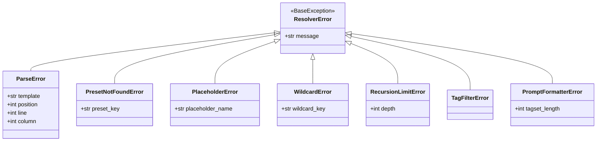

### 5.3 エラー処理パターン

#### パターン1: strict_level対応

```python
try:
    tags = self.resolve_preset(preset_name)
except PresetNotFoundError as e:
    if context.strict_level == "error":
        raise
    elif context.strict_level == "warn":
        logger.warning(f"PresetNotFound (fallback=empty): {e}")
        tags = OrderedSet()
    else:  # soft
        tags = OrderedSet()
```

#### パターン2: RecursionLimitError

```python
context.reparse_depth += 1
if context.reparse_depth > MAX_DEPTH:
    raise RecursionLimitError(
        f"Preset reparse depth exceeded {MAX_DEPTH}",
        depth=context.reparse_depth
    )
```

#### パターン3: 位置情報付きエラー

```python
try:
    tree = parser.parse(template)
except LarkError as e:
    raise ParseError(
        f"Template parsing failed: {e}",
        template,
        position=e.pos_in_stream,
        line=e.line,
        column=e.column
    )
```

### 5.4 ComfyUI APIエラー（/prompt）

ComfyUIへの `POST /prompt` が **HTTP 400** を返す場合、本文に「どのノード/入力が不正か」のJSONが含まれることがあります。  
現行実装では `core/api_client.py` が **HTTPError時にエラー本文をログ出力**し、原因特定ができるようになっています。

---

## 6. 拡張機能

### 6.1 レポート生成

**実装**: `core/reporting/`モジュール

**主要クラス**:
- `BaseReportGenerator`: 抽象基底クラス
- `HTMLReportGenerator`: HTML形式レポート生成
- `Reporter`: ファサードクラス

**使用例**:
```python
reporter = Reporter()
reporter.generate_html_report(
    job_id=job_id,
    job_name="my_job",
    image_records=images,
    variables=variables
)
```

**出力**: `results/report_{job_id}_{job_name}.html`

### 6.2 MockServices（テスト用）

**実装**: `core/mock_services.py`

**提供クラス**:
- `MockDatabaseManager`: DB操作のモック
- `MockAPIClient`: API通信のモック
- `MockPromptResolver`: プロンプト解決のモック

**使用例**:
```python
from core.mock_services import MockServiceContainer

container = MockServiceContainer(config)
executor = GridSearchExecutor(config, container)
```

### 6.3 パフォーマンス監視

**実装箇所**:
- Parse: Larkキャッシュ（13.5倍高速化）
- Placeholder/Wildcard: LRUキャッシュ（50エントリ）
- PresetEval: OrderedSet高速集合演算

**メトリクス**:
- パース時間: 0.001秒（キャッシュ後）
- 複雑テンプレート: 0.005秒未満
- メモリ使用: 1000回解析で安定

### 6.4 プロンプトのダンプ（--dump-prompts）

**目的**: job設定をロードして `scene_delta` / `runs` / `%constants%` / `$[iterators]` を展開し、最終的な解決済みプロンプトをファイルに出力する（実行はしない）。

**CLI**:
```bash
python main.py --job-config "configs/jobs/xxx.yaml" --dump-prompts "out.txt"
```

---

## 7. 将来計画

### 7.1 予定機能

#### ネスト構造サポート（プリセット）

**現状**: `<preset:name#group_anime>`（アンダースコア記法）

**予定**: `<preset:name#group.anime>`（ドット記法サポート）

```yaml
contents:
  style:
    anime: "anime style tags"
    realistic: "realistic style tags"
```

```
<preset:example#style.anime>  # 将来サポート
```

#### sort_alpha機能

**目的**: タグをアルファベット順にソート

```yaml
# 設定
sort_alpha: true

# 入力
tagset = ["zebra", "apple", "banana"]

# 出力
"apple, banana, zebra"
```

#### shuffle機能

**目的**: タグをランダムにシャッフル

```yaml
# 設定
shuffle: true
seed: 12345

# 入力
tagset = ["tag1", "tag2", "tag3"]

# 出力（シード値で再現可能）
"tag2, tag1, tag3"
```

### 7.2 技術的課題

- Pydantic v2 deprecation警告対応
- パフォーマンス回帰テスト自動化
- 大規模データでのメモリ使用量監視

### 7.3 長期ビジョン

- Web UIによる設定管理
- リアルタイムプレビュー機能
- 画像品質評価の自動化
- LoRA最適化アルゴリズム

---

## 8. 付録

### A. 用語集

| 用語 | 説明 |
|------|------|
| **AST** | 抽象構文木（Abstract Syntax Tree）。テンプレートをツリー構造で表現 |
| **TagSet** | 順序付きタグ集合（OrderedSet[str]）。プロンプトを構成するタグの集合 |
| **Executor** | ジョブ実行戦略の実装クラス |
| **PromptResolver** | プロンプトテンプレートを最終プロンプト文字列に解決するシステム |
| **PresetExpr** | プリセット式ノード（`<preset:...>`） |
| **Placeholder** | プレースホルダーノード（`{...}`） |
| **Wildcard** | ワイルドカードノード（`__...__`） |
| **strict_level** | エラー処理レベル（error/warn/soft） |
| **locale** | 出力時の区切り文字設定（`,`/`、`/`;`） |
| **Iterator** | シーケンシャルな値巡回機能（`$[...]`） |
| **Constant** | 固定文字列定数（`%...%`） |

### B. 設定サンプル集

#### サンプル1: LoRA比較検証

```yaml
job_type: "grid_search"
job_name: "lora_comparison"
base_workflow: "./workflows/base.json"

variables:
  - node_id: "CR LoRA Stack"
    input_name: "lora_name_1"
    values:
      - "character_lora_v1.safetensors"
      - "character_lora_v2.safetensors"
      - "character_lora_v3.safetensors"
  
  - node_id: "CR LoRA Stack"
    input_name: "model_weight_1"
    values: [0.6, 0.8, 1.0]
  
  - node_id: "KSampler"
    input_name: "cfg"
    values: [5.0, 7.0, 9.0]

fixed_parameters:
  - {node_id: "KSampler", input_name: "seed", value: 42}
  - {node_id: "KSampler", input_name: "steps", value: 20}
```

#### サンプル2: キャラクターバリエーション生成

```yaml
job_type: "sequence"
job_name: "character_variations"
base_workflow: "./workflows/base.json"

constants:
  base_quality: "masterpiece, best quality, amazing quality"
  base_character: "1girl, alice \\(character\\)"

iterators:
  expression:
    expand_preset: "expression"
  location:
    - "in a library"
    - "in a cafe"
    - "in a park"

prompt_target:
  node_id: "CLIPTextEncodeSDXL"
  input_name: "text_g"

random_parameters:
  - {node_id: "KSampler", input_name: "seed", type: "int", range: [0, 999999999]}

prompts:
  - template: "%base_quality%, %base_character%, $[expression], $[location]"
    runs: 9
```

### C. トラブルシューティング

#### 問題: プリセットが見つからない

**症状**:
```
WARNING: Preset 'quality' not found (fallback=empty)
```

**解決**:
1. ファイルパスを確認: `prompts/presets/quality.yaml`
2. ファイル形式を確認: V2形式の場合`contents:`キーが必要
3. プリセット名を確認: ファイル名（拡張子なし）と一致するか

#### 問題: ノード名が解決されない

**症状**:
```
WARNING: Node 'VAEデコード' not found in workflow
```

**解決**:
1. ワークフローファイルを確認
2. ノード一覧を確認: `uv run python demo_workflow_loader.py`
3. 重複ノード名の場合はノードID指定に変更

#### 問題: メモリ不足エラー

**症状**:
```
RecursionLimitError: Placeholder expansion too large: >128 combinations
```

**解決**:
1. placeholders数を減らす
2. expandモード使用を見直し（sampleモード推奨）
3. GridSearchの軸数を減らす

### D. 参考リンク

- [ComfyUI公式](https://github.com/comfyanonymous/ComfyUI)
- [Larkドキュメント](https://lark-parser.readthedocs.io/)
- [Pydanticドキュメント](https://docs.pydantic.dev/)

---

**ドキュメント終わり**
